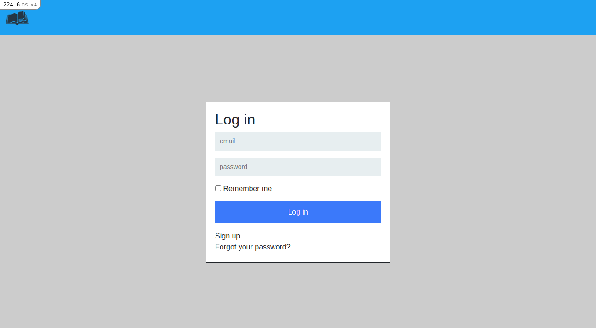

# Twitter-Redesign-Capstone

This is a ruby on rails capstone project that entails building a social media app with functionalities similar to Twitter. This app provides a platform for people to share opinions about books. Here, users can log in, view their homepage/opinions, suggested followers, gain access to their profiles and that of other followers, and then create opinions.



## Built With

- Ruby -v 2.7.2
- Rails -v 6.1.3.2
- Devise
- Bootstrap 5
- PostgreSQL
- RSPEC

## Live Demo

- [Live Demo Link]()


## Getting Started

### Prerequisites

To set up this project and get it running locally, Ruby, Rails and all other relevant gems must be installed in your system.
**simple steps set up on your local machine**

```
- $ git clone `$ git clone git@github.com:JulianaOsemeke/Redesign-twitter-ror-capstone.git`
- $ git checkout development
- Run `cd Capstone`
- $ bundle install
- $ rails db:create
- $ rails db:migrate
```


## Author

👤 **Juliana Osemeke**

- GitHub: [@JulianaOsemeke](https://github.com/JulianaOsemeke)
- LinkedIn: [@juliana-osemeke](https://www.linkedin.com/in/juliana-osemeke/)
- Twitter: [@JulianaOsemeke](https://twitter.com/JulianaOsemeke)

````


## Acknowledgment

-[Gregoire Vella on Behance](https://www.behance.net/gregoirevella)

